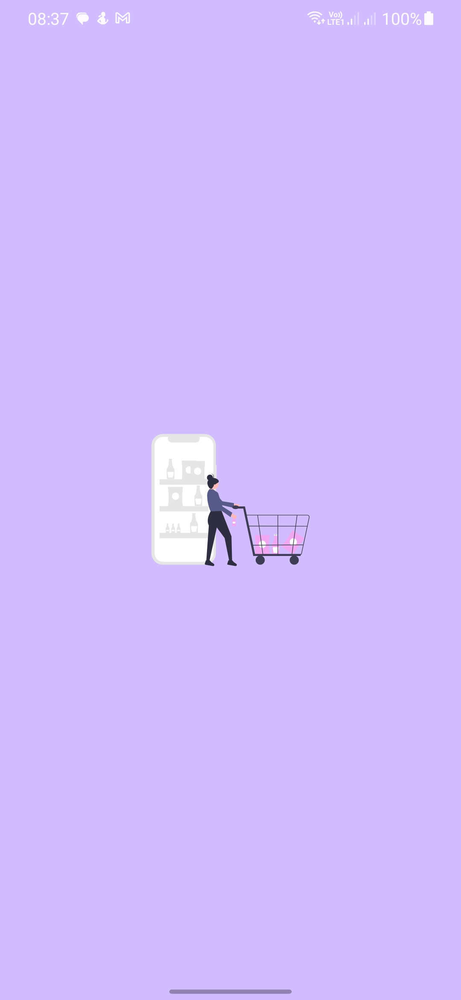
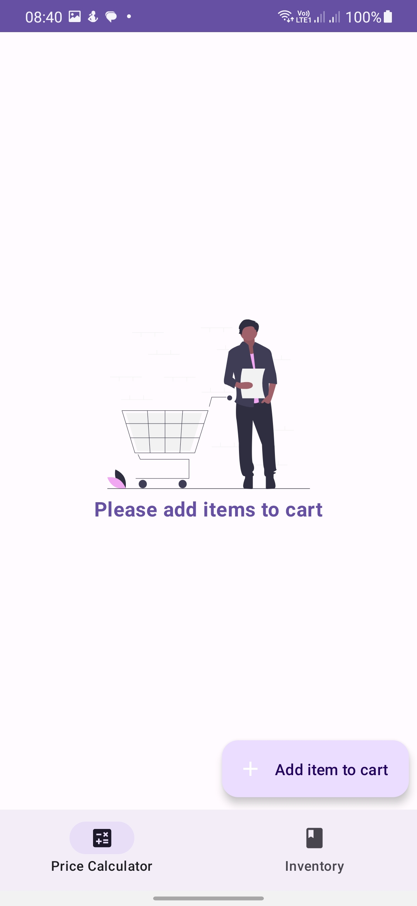
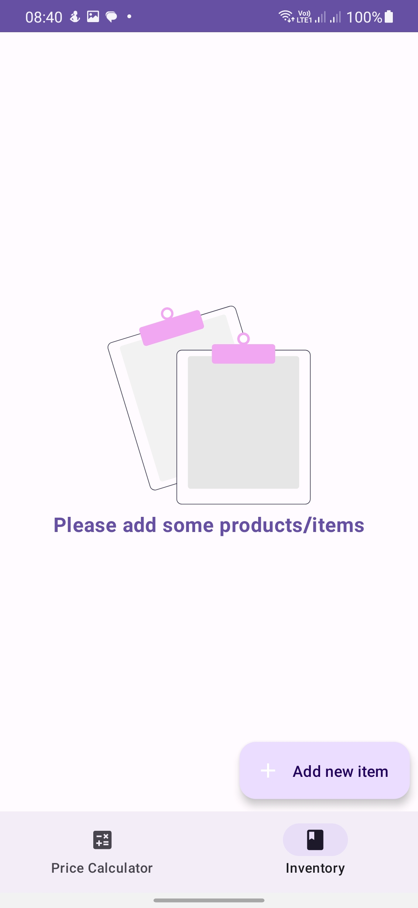
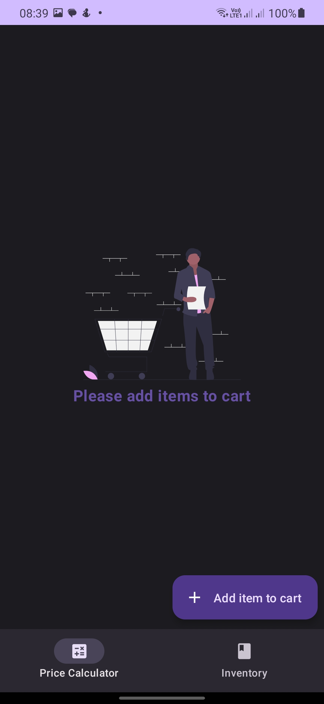
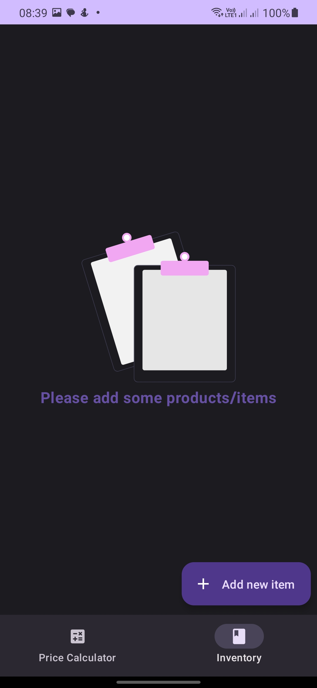
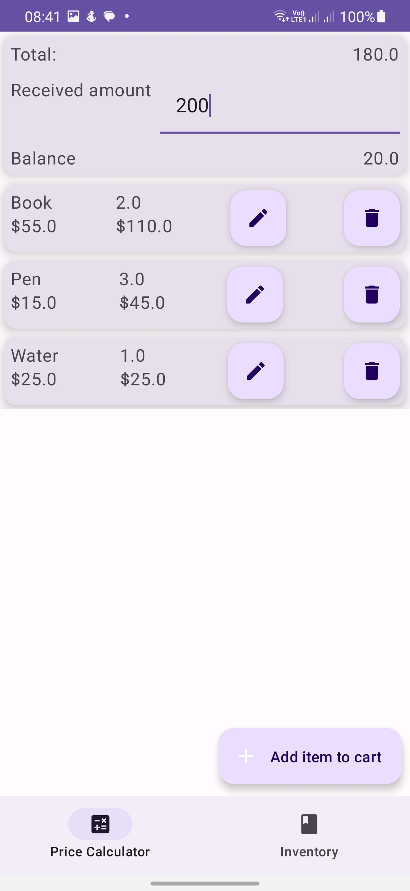
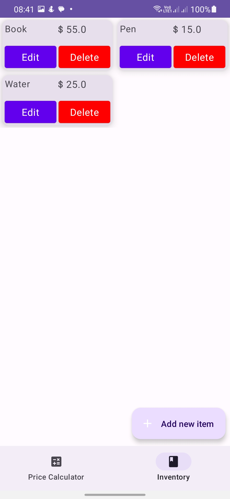
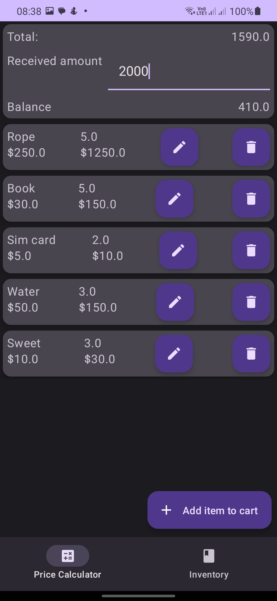
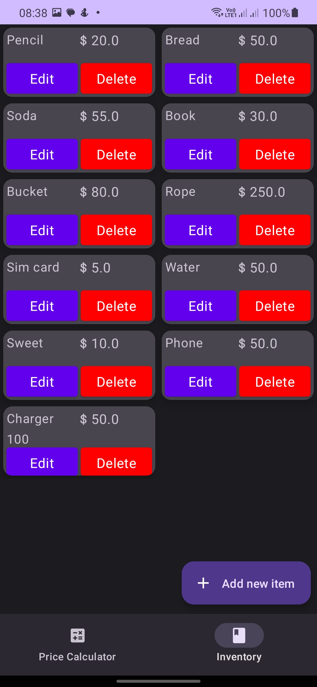

## Shop calculator 

An app that helps manage inventory and sales of goods

Min Api Level: 24 [Android 7.0](https://developer.android.com/studio/releases/platforms)

Build System : [Kotlin DSL]([https://gradle.org/](https://developer.android.com/build/migrate-to-kotlin-dsl))

## Screenshots

|             |    |    |
|-------------------------------------------|--------------------------------------------|-------------------------------------------|
|    |      |          |
| ----------------------------------------- | ------------------------------------------ | ----------------------------------------- |
|          |           |           |

## Libraries and plugins

- [Koin](https://insert-koin.io/) - Koin provides an easy and efficient way to incorporate dependency injection into any Kotlin application(Multiplatform, Android, backend ...)
- [Room](https://developer.android.com/training/data-storage/room) -  The Room persistence library provides an abstraction layer over SQLite to allow fluent database access while harnessing the full power of SQLite.
- [KSP](https://kotlinlang.org/docs/ksp-overview.html) - A Kotlin-first alternative to kapt. KSP analyzes Kotlin code directly, which is up to 2x faster. It also has a better understanding of Kotlin's language constructs.
